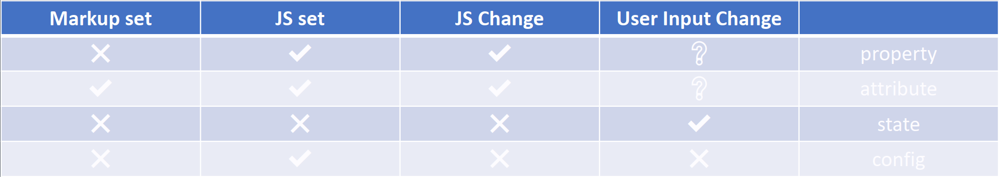

学习笔记

## 组件的基本知识

### 基本概念

- 前端架构两大主题：组件化，架构模式
  - 组件化，扩展HTML标签，目标是提高复用率，降低开发者的心智负担
  - 架构模式，例如 MVC, MVVM 等，关注点是 UI 与数据逻辑之间的交互方式

- 对象与组件
  - 组件：一般与 UI 层强相关；树形结构组合(composite)；模板化配置能力
  - 对象的要素：
    - properties 属性
    - methods 方法
    - inherit 继承关系
  - 组件在对象基础上增加：
    - attribute - 用法是通过 markup 向组件传入信息，区别于通过对象的 property / method 读写信息
    - config (构造参数) & state (运行期间状态)
    - event - 向组件使用者传递信息
    - lifecycle
    - children - 组成树形结构

  - attribute vs. property
    - attribute 描述对象自身内在特性  
      ```javascript
      compo.getAttribute(attrName);
      compo.setAttribute(attrName, value);
      ```
    - property 用于描述拥有/从属关系
      ```javascript
      compo.attr = value
      ```
    - HTML 当中 attr 与对应的 property 不同
      - 名称不同
        ```html
        <div class="cls1 cls2"/>
        <script>
          var div = document.getElementsByTagName('div')[0];
          console.log(div.className);
          console.log(div.getAttribute('class'));
        </script>
        ```
      - 类型不同
        ```html
        <div class="cls1 cls2" style="color:blue"/>
        <script>
          var div = document.getElementsByTagName('div')[0];
          console.log(div.style); // CSSStyleDeclaration 对象
          console.log(div.getAttribute('style')); // 字符串
        </script>
        ```
      - 值不同
        ```html
        <a href="//m.example.com">link</a>
        <script>
          var a = document.getElementsByTagName('a')[0];
          console.log(a.href); // 解析后的值， 'https://m.example.com'
          console.log(a.getAttribute('href')); // 原值
        </script>
        ``` 
      - input value
        - attribute 值是默认值，不随用户输入或 input.value property 赋值而改变
        - property 值随用户输入而改变

  - 如何设计组件状态
    
    - prop / attr 多数情况下不受最终用户操作影响(除非业务逻辑需要)
    - state 由组件内部逻辑控制，可由最终用户操作影响，不可由外部代码改动
    - config 只在组件构造时使用一次，是 const；通常可声明在页面全局

  - lifecycle 组件的生命期
    - create, destroy
    - mount, mounted, unmounted
    - 用户操作或属性设置触发 - update

  - children 组件树形结构
    - content - 实际子节点数量与代码中一致
    - template - list item template, 实际子节点数量取决于列表项数量
    
### 为组件添加 JSX 语法

组件由 markup 与 js 代码构成

演示支持 JSX markup 的组件开发

- 准备开发环境
  - `node init` # 创建项目
  - `npm i -g webpack webpack-cli` # 全局安装 webpack 命令行
  - 进入项目目录，`npm i -D babel-loader @babel/core @babel/preset-env webpack`
  - 创建 webpack.config.js 并引入 babel-loader 处理 .js 文件，采用 preset-env 预设配置 babel-loader
- 实现通过 JSX 语法定义组件
  - JSX 语法代码直接编译不能通过 
    - 错误信息中提示可以配置 `@babel/plugin-syntax-jsx (https://git.io/vb4yA)`
  - `npm i -D @babel/plugin-transform-react-jsx` - JSX 语法被转译为 React.createElement 函数调用
  - 给 @babel/plugin-transform-react-jsx 插件配置 pragma 选项，指定改为调用别的函数
  - 实现自定义的 createElement 函数，根据传入的参数，实际创建 DOM 节点树
  - 当 JSX 中出现非 HTMLElement 的节点类型名，createElement 函数的参数将传入自定义类型标识符
  - 扩展 createElement 实现，遇到自定义节点类型时创建对应的类对象，类内实现创建 DOM 节点树所需的接口方法
  - 通过以上步骤，可以实现添加代码逻辑扩充组件的行为，从而实现通过 JSX 语法引入自定义组件

## 设计实现轮播组件
