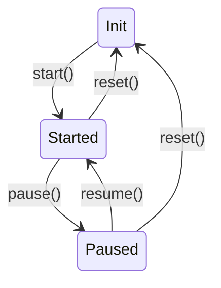

学习笔记

## 调试说明

进入 animation 项目目录, 启动 webpack-dev-server:

```bash
cd animation/
npm run dev
# 或通过 npx 执行
npx webpack-dev-server
```

随后浏览器打开 http://localhost:8080/main.html

第 3 小节及之后打开 http://localhost:8080/animation.html

## 动画

- JS 中实现动画的几种模式

  - setInterval(tick , 16)
  - setTimeout(tick, 16)
  - **(推荐)** requestAnimationFrame(tick)

- 应用 RAF 的 Timeline 框架

  - 利用 Symbol 隐藏私有函数 tick()
  - start(), pause(), resume() - 通过控制 RAF 实现
  - rate - 帧速率调整
  - reset() - 清除已加入的动画

- 逐步变更对象属性值的动画

  - Animation 对象负责根据 当前时刻 距离 开始时刻 的时长计算并设置当前属性值
  - Timeline 对象持有尚未完成动画的 Animation 对象的引用，提供当前时长信息，驱动 Animation 对象

- 加入暂停和重启

  - 新增 animation.html 和 animation-demo.js, 用 Animation 对象控制 DOM 元素的属性值, 及增加按钮调试 pause, resume
    - 需要在 webpack.config.js 配置中添加新 JS 文件的 entry, 让 webpack 对新文件进行 transpile. 或 html 中以 `type="module"` 方式引入 ESM 模块文件.
    - [Entry Points 参考文档](https://webpack.docschina.org/concepts/entry-points/) - 对每个独立 HTML 文件创建一个 entry
  - 暂停: cancel 上次 RAF 得到的 handle
  - 继续: pause 时记录时间戳; resume 时计算暂停时长; tick 中扣除暂停时长.

- 实现 delay, timingFunction, reset

  - 计算传给 Animation.receiveTime() 的 t 值时, 要减去 delay; t 值为负时不启动, t > 0 时才调用 receiveTime(t)
  - 引入 progress 变量，改为由 timingFunction 负责计算
  - 引入 [Cubic Bezier](https://cubic-bezier.com/) 算法定义的 ease 系列 timingFunction

- Timeline 类引入状态管理
  - 引入 this.state, 各接口方法限定入口状态 (解决了 pause 之后多次 resume 造成回退的问题)


